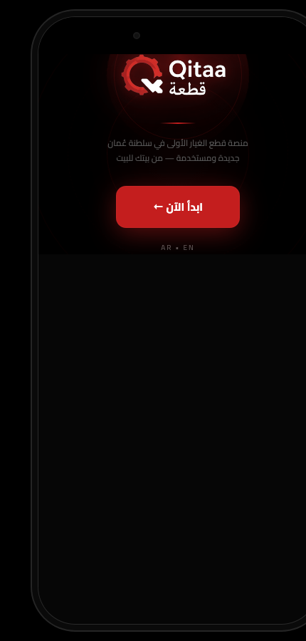

# قِطعة · Qitaa — Oman's first auto-parts marketplace

A startup concept and clickable bilingual (Arabic/English) app prototype that connects drivers with spare-parts shops in Oman.
Developed as an Entrepreneurship project at UTAS (2025-26) and pushed further as a real startup idea.

## The problem
Finding one car part today means driving to **3–5 shops**, losing **2–4 hours**, and facing **30%+ price differences**.

## The solution
A marketplace where shops list parts and drivers search, compare prices and order — with an Instagram-style feed for shops.

## What's here
| File | Description |
|---|---|
| `index.html` | Interactive mobile prototype (open in a browser) |
| `docs/qitaa-prototype-deck.pdf` | Prototype & pitch deck |
| `docs/business-model-canvas.png`, `docs/qitaa-strategic-bmc.pdf` | Business Model Canvas |

Also produced: full business plan, investor presentation and concept statement (not included).

## Built with
HTML · CSS · JavaScript · GitHub Pages-ready. AI tools used for research and visuals (Claude, Gemini).
